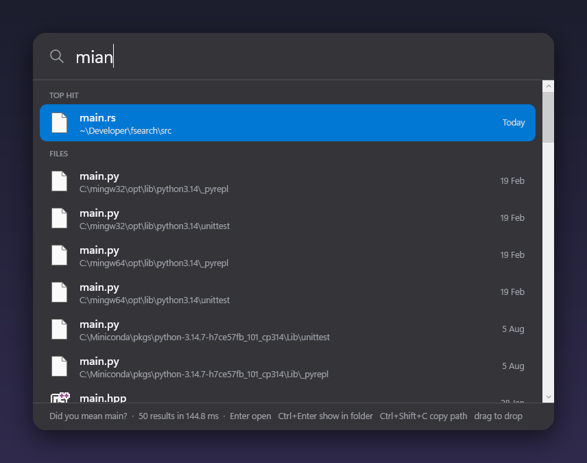
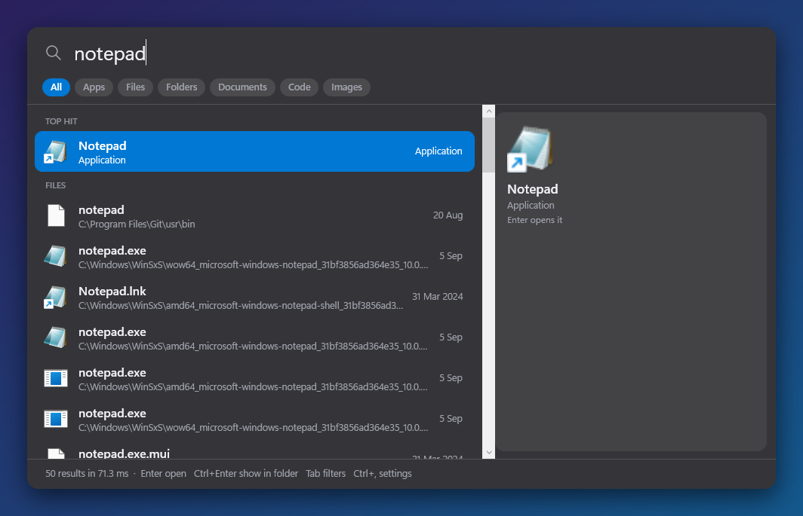
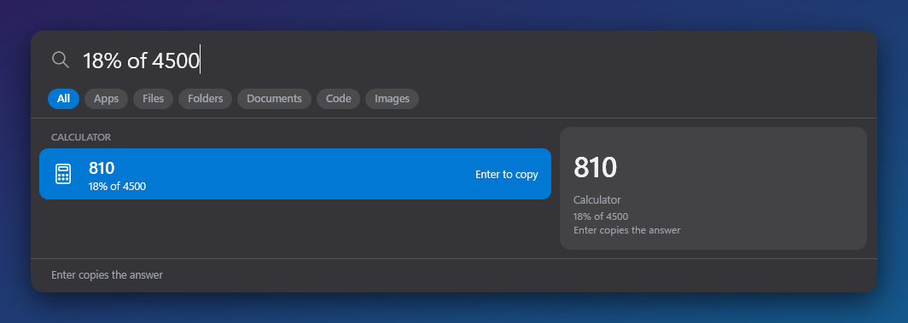
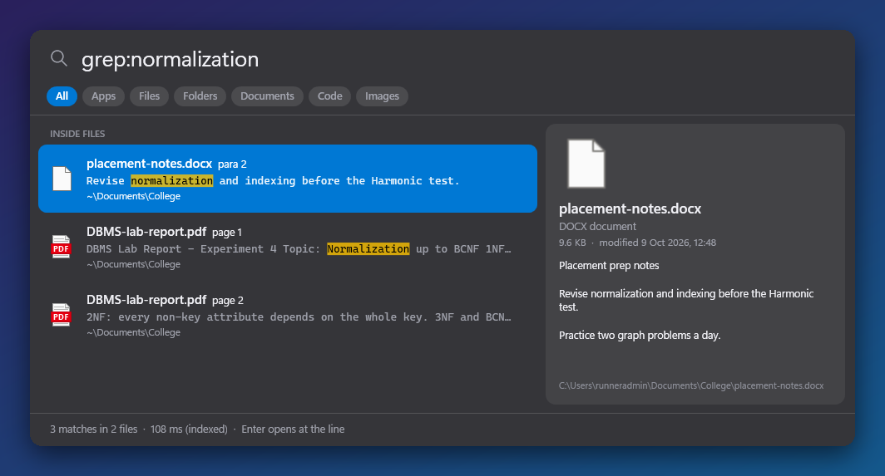
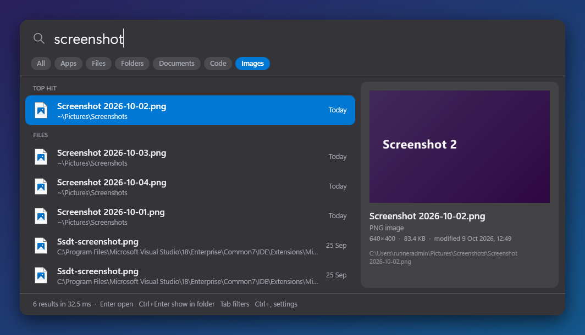

# Glint

Spotlight-style search for Windows. Press **Alt+Space**, the bar drops in, and any file, app, Settings page or sum is a few letters away — typos included.



> Real screenshots from Glint 0.2 on Windows (GitHub Actions `windows-latest`: 1,341,280 files indexed from the NTFS MFT in 43.6 s, then reloaded from the saved index in 0.55 s). The runner is Windows Server, so they show the solid dark panel; Windows 11 gets acrylic glass. Sample files come from [`tools/ci-samples.ps1`](tools/ci-samples.ps1), and the [demo workflow](.github/workflows/demo.yml) retakes these on every change.

| Apps and Settings | Calculator and units |
| --- | --- |
|  |  |
| **Search inside PDFs and Word files** | **Image preview and filter chips** |
|  |  |

A Windows port of [fsearch](https://github.com/noahdunnagan/fsearch) by Noah Dunnagan (MIT), rebuilt in C#/WPF with a launcher UI.

## Download

Grab **Glint.exe** from the [latest release](../../releases/latest). It is one self-contained file for Windows 10/11 x64: no installer, no .NET to install.

1. Move it somewhere permanent first (for example `%LocalAppData%\Programs\Glint\`), not Downloads, because *Open at sign-in* points at wherever it is.
2. Run it. The file isn't code-signed, so SmartScreen may warn: choose **More info → Run anyway**.
3. Right-click the tray icon → **Use fast NTFS index** for the fastest index (one UAC prompt, then none at sign-in).
4. Press **Alt+Space**. If another app owns that shortcut (PowerToys Run, for one), Glint falls back to Ctrl+Alt+Space, or pick one in **Settings**.

Or with Scoop:

```
scoop install https://github.com/Benfranklinms/Glint/releases/latest/download/glint.json
```

Each release also carries `Glint.exe.sha256` and ready-made winget manifests (`winget-manifests.zip`); Glint isn't in the winget catalogue yet.

**Updating:** Glint checks GitHub once a day, downloads a new `Glint.exe` in the background and offers **Restart to update** in the tray. Turn it off in Settings.

**Uninstalling:** untick *Open at sign-in*, quit from the tray, then delete `Glint.exe` and `%LocalAppData%\Glint`. Glint sends no telemetry; the only network call is the update check to GitHub, which you can switch off.

## What it does

- **Whole-disk name search.** Every file and folder on every fixed drive, ranked as you type. USB and network drives can be added in Settings.
- **Ready instantly.** The index is saved to disk (about 15 MB per 1.3M files), so after the first run Glint is searchable in about half a second and catches up on what changed while it was closed from the NTFS change journal.
- **Forgives typos.** 4-letter words forgive a swapped pair (`mian` → `main`), 5+ letters forgive any one mistake (`raedme` → `README.md`).
- **Opens apps and Settings.** Start-menu and Store apps, about 40 Settings pages (`bluetooth`, `wifi`, `dark mode`, `startup apps`) and tools like Device Manager, Task Manager and Registry Editor.
- **Does sums and conversions.** `18% of 4500`, `(2+3)^2`, `sqrt(2)`, `5 km in miles`, `100 f to c`, `2 gb in mb`. Enter copies the answer.
- **Learns what you open.** Things you open often and recently rise to the top, and an empty bar shows them. Kept on your PC only; *Clear history* is in Settings.
- **Preview pane.** Pictures, the first lines of code and text (or the lines around a grep match), PDF and Word text, and folder contents, with size and date. Ctrl+P hides it.
- **Filter chips.** All, Apps, Files, Folders, Documents, Code, Images. Tab or Ctrl+1…7 switches.
- **Searches inside files, fast.** `grep:apply_dir` or `regex:fn\s+\w+_dir`, smart-case, with the match highlighted. A background trigram index of your user folder and other drives means a grep only opens the few files that can match. Enter opens VS Code at the line when `code` is on your PATH.
- **Reads PDFs and Office files too.** PDF text page by page; `.docx`, `.pptx`, `.xlsx`, `.odt` and `.odp` show the page, slide or paragraph.
- **Your files first.** Results in your user folder outrank toolchains, caches and system trees like `Windows`, `WinSxS`, `Program Files` and `AppData`. Hide any folder entirely in Settings.
- **Starts with Windows.** *Open at sign-in* is on from the first run; once fast mode is on, a logon task starts it with admin rights so there is no UAC prompt at boot.
- **Drops in like Spotlight.** Centered on the monitor your pointer is on, with a short spring and fade. Light, dark or follow Windows; acrylic glass on Windows 11 22H2+.
- **Grab the file.** Drag a result into Explorer, a chat or an upload box. Ctrl+C copies the file itself, Ctrl+Shift+C copies its path.

## Keys

| Key | Does |
| --- | --- |
| Alt+Space | Show / hide (change it in Settings) |
| ↑ ↓ | Move through results |
| Enter | Open (copies a calculator answer) |
| Ctrl+Enter | Show in folder |
| Tab / Shift+Tab, Ctrl+1…7 | Switch filter chip |
| Ctrl+P | Show / hide the preview |
| Ctrl+, | Settings |
| Ctrl+C / Ctrl+Shift+C | Copy file / copy path |
| Esc | Clear, then reset the chip, then hide |

## Settings

Tray → **Settings…** or Ctrl+, in the bar. Shortcut, theme, preview, apps and calculator, open at sign-in, fast NTFS index, saved index, USB and network drives, hidden folders, content index on/off and its folders, automatic updates, *Rebuild index* and *Clear history*. Everything lives in `%LocalAppData%\Glint` (`settings.json`, `index.bin`, `content.bin`, `usage.json`).

## Query syntax

```
readme in:~/Developer          inside a folder
type:image size:>5mb mtime:<7d  kind, size and age
ext:rs,toml cargo               by extension
'exact  ^prefix  suffix$  !exclude
grep:TODO in:~/Projects         inside files
```

Filters: `ext:` `type:` `kind:` `in:` `path:` `size:` `mtime:` `grep:` `regex:` `limit:`.

## How it works

- **Fast mode (administrator):** reads each NTFS drive's master file table with `FSCTL_ENUM_USN_DATA` — seconds for millions of files — then follows the USN change journal, so new, renamed and deleted files show up within about 0.1 s.
- **Normal mode:** a background folder crawl plus `FileSystemWatcher`. Same results, slower first index.
- **Saved index:** names, parents and flags are written gzip-compressed to `index.bin` every ten minutes (when something changed) and on exit. On start Glint loads it, then replays the USN journal from where it left off; if the journal has wrapped, or in normal mode, it rebuilds in the background while you search the saved copy.
- **What's indexed:** every file and folder name on fixed drives (plus USB or network drives if you turn them on). Hidden system files, the Recycle Bin and folders you hide are left out.
- Names live in flat arrays with a per-name character mask, so most of the disk is ruled out with one AND before any string work. Scoring favours whole-name and word-start matches, your user folder, shallow paths and what you open, and pushes down `Windows`, `WinSxS`, `AppData`, `node_modules` and friends.
- **Content index:** each text, code, PDF and Office file gets a small Bloom filter of its three-letter runs (about a byte per distinct trigram), saved to `content.bin` and kept current by a folder watcher. A `grep:` opens only files whose filter holds every trigram of the search; `regex:` uses the literal runs the pattern must contain. Searches outside the indexed folders, or before the first build finishes, fall back to a parallel scan. Binaries, text over 4 MB, documents over 60 MB and folders like `.git`, `node_modules`, `build`, `vendor`, `bin`, `obj` are skipped.

## Differences from fsearch

| | fsearch (macOS) | Glint (Windows) |
| --- | --- | --- |
| Interface | CLI + daemon, Rust crate | Launcher bar + tray, apps, Settings, calculator |
| First index | `getattrlistbulk` | NTFS MFT (admin) or folder crawl, then saved to disk |
| Live updates | FSEvents | USN journal or FileSystemWatcher |
| Content search | Trigram index, text files | Trigram Bloom index, text + PDF + Office |
| Speed | ~1 ms names | 26–110 ms on 1.34M names on a 2-core CI runner |

## Build

```
dotnet publish src/Glint.csproj -c Release -r win-x64 --self-contained true -p:PublishSingleFile=true
```

GitHub Actions builds `Glint.exe` on every push and attaches it, its checksum and the Scoop/winget manifests to `v*` releases. `Glint.exe --demo <dir> <query>...` indexes, reloads from the saved index, runs each query and saves screenshots; CI uses it for the images above.

## License

MIT — see [LICENSE](LICENSE). Original fsearch © Noah Dunnagan. PDF text extraction uses [PdfPig](https://github.com/UglyToad/PdfPig) (Apache-2.0).
