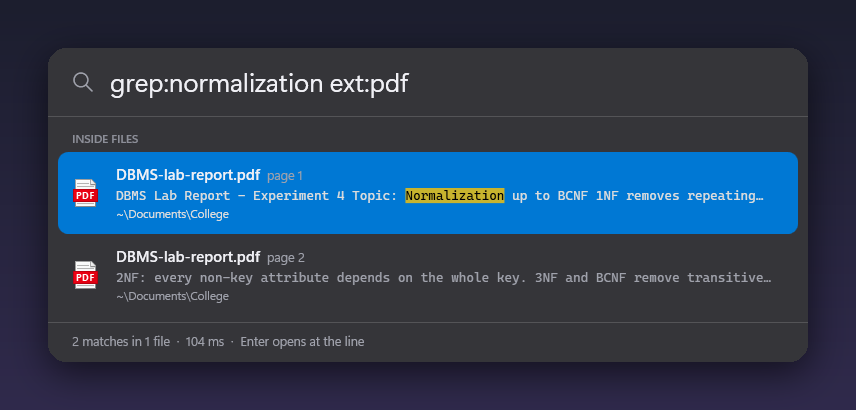
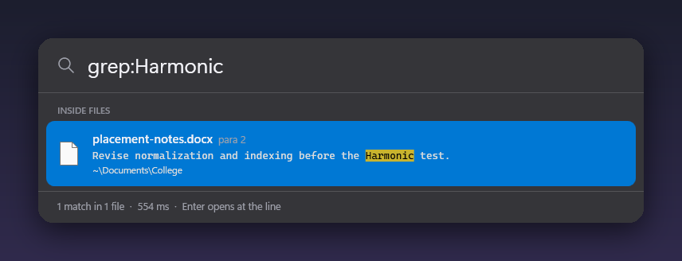
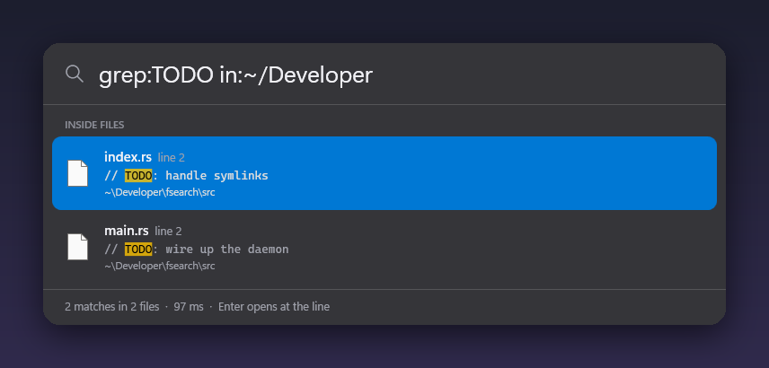

# Glint

Spotlight-style search for Windows. Press **Alt+Space**, the bar drops in, and any file on your disk is a few letters away — typos included.


> Real screenshots from Glint running on Windows (GitHub Actions `windows-latest`, 1,341,289 files indexed from the NTFS MFT in 43 s). The runner is Windows Server, so they show the solid dark panel; Windows 11 gets acrylic glass. The sample files are laid out by [`tools/ci-samples.ps1`](tools/ci-samples.ps1), and the [demo workflow](.github/workflows/demo.yml) retakes these on every change.

| Search inside PDFs | Inside Word documents |
| --- | --- |
|  |  |
| **Inside code** | **Typos fixed** |
|  |  |

A Windows port of [fsearch](https://github.com/noahdunnagan/fsearch) by Noah Dunnagan (MIT), rebuilt in C#/WPF with a launcher UI.

## Download

Grab **Glint.exe** from the [latest release](../../releases/latest). It is one self-contained file for Windows 10/11 x64: no installer, no .NET to install.

1. Run it. The file isn't code-signed, so SmartScreen may warn: choose **More info → Run anyway**.
2. Right-click the tray icon → **Use fast NTFS index** for the fastest index (one UAC prompt, then none at sign-in).
3. Press **Alt+Space**. If another app owns that shortcut (PowerToys Run, for one), Glint falls back to Ctrl+Alt+Space, or you can pick one in the tray.

## What it does

- **Whole-disk name search.** Every file and folder on every fixed drive, ranked as you type.
- **Forgives typos.** 4-letter words forgive a swapped pair (`mian` → `main`), 5+ letters forgive any one mistake (`raedme` → `README.md`).
- **Searches inside files.** `grep:apply_dir` or `regex:fn\s+\w+_dir`, smart-case, with the match highlighted. Enter opens VS Code at the line when `code` is on your PATH.
- **Reads PDFs and Office files too.** `grep:normalization ext:pdf` searches PDF text page by page; `.docx`, `.pptx`, `.xlsx`, `.odt` and `.odp` work the same way, showing the page, slide or paragraph.
- **Your files first.** Results in your user folder outrank toolchains, caches and system trees like `Windows`, `Program Files` and `AppData`.
- **Starts with Windows.** It turns on *Open at sign-in* the first time it runs; once fast mode is on, a logon task starts it with admin rights so there is no UAC prompt at boot.
- **Drops in like Spotlight.** Centered on the monitor your pointer is on, with a short spring and fade. Acrylic glass on Windows 11 22H2+, a solid dark panel elsewhere.
- **Grab the file.** Drag a result into Explorer, a chat or an upload box. Ctrl+C copies the file itself, Ctrl+Shift+C copies its path.

## Keys

| Key | Does |
| --- | --- |
| Alt+Space | Show / hide (change it in the tray menu) |
| ↑ ↓ | Move through results |
| Enter | Open |
| Ctrl+Enter | Show in folder |
| Ctrl+C / Ctrl+Shift+C | Copy file / copy path |
| Esc | Clear, then hide |

## Query syntax

```
readme in:~/Developer          inside a folder
type:image size:>5mb mtime:<7d  kind, size and age
ext:rs,toml cargo               by extension
'exact  ^prefix  suffix$  !exclude
grep:TODO in:~/Projects         inside files
```

Filters: `ext:` `type:` `kind:` `in:` `path:` `size:` `mtime:` `grep:` `regex:` `limit:`.

## How it works

- **Fast mode (administrator):** reads each NTFS drive's master file table with `FSCTL_ENUM_USN_DATA` — seconds for millions of files — then follows the USN change journal, so new, renamed and deleted files show up within about 0.1 s. Pick *Use fast NTFS index* in the tray to restart elevated; *Open at sign-in* then registers a logon task so there is no UAC prompt each time.
- **Normal mode:** a background folder crawl plus `FileSystemWatcher`. Same results, slower first index.
- **What's indexed:** every file and folder name on internal (fixed) drives. Hidden system files, the Recycle Bin and USB or network drives are left out. The index is rebuilt each time Glint starts (about 40 s for 1.3M files in fast mode); saving it to disk is planned.
- Names live in flat arrays with a per-name character mask, so most of the disk is ruled out with one AND before any string work. Scoring favours whole-name and word-start matches, your user folder, and shallow paths, and pushes down `Windows`, `AppData`, `node_modules` and friends.
- Content search reads files fresh from disk in parallel. Unlike fsearch there is **no trigram index yet**, so it scans `in:` when given, the name matches when you typed other words, and your user folder otherwise. It skips binaries, files over 4 MB, and folders like `.git`, `node_modules`, `build`, `vendor`, `bin`, `obj`.

## Differences from fsearch

| | fsearch (macOS) | Glint (Windows) |
| --- | --- | --- |
| Interface | CLI + daemon, Rust crate | Launcher bar + tray |
| First index | `getattrlistbulk` | NTFS MFT (admin) or folder crawl |
| Live updates | FSEvents | USN journal or FileSystemWatcher |
| Content search | Trigram index, text files | Parallel scan (index planned), text + PDF + Office |
| Speed | ~1 ms names | 87–220 ms on 1.34M names on a 2-core CI runner |

## Build

```
dotnet publish src/Glint.csproj -c Release -r win-x64 --self-contained true -p:PublishSingleFile=true
```

GitHub Actions builds `Glint.exe` on every push and attaches it to `v*` releases. `Glint.exe --demo <dir> <query>...` indexes, runs each query and saves screenshots; CI uses it for the images above.

## License

MIT — see [LICENSE](LICENSE). Original fsearch © Noah Dunnagan. PDF text extraction uses [PdfPig](https://github.com/UglyToad/PdfPig) (Apache-2.0).
